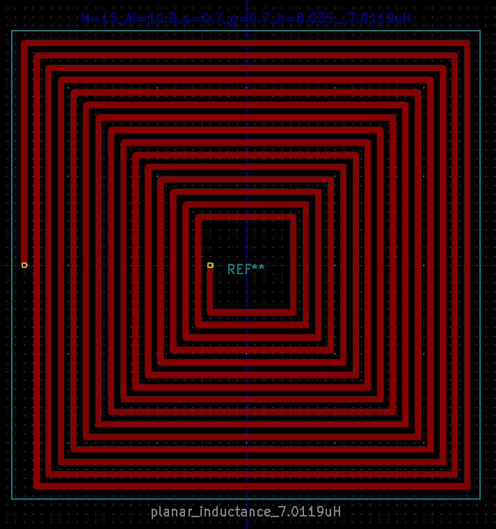

# Square planar inductor pcb footprint generator for KiCad EDA.

## psikic.py - PCB Planar Inductor utility

Sometimes there is a need to generate an inductor directly onto a PCB. This utility helps you generate a square planar inductor for importing into the Footprint Editor of [KiCad EDA](https://kicad-pcb.org). From the geometrical parameters provided to the utility the inductance is also calculated together with a determination of the inductance using [Fasthenry](https://www.fastfieldsolvers.com/fasthenry2.htm) for comparison. 

The motivation for creating this utility came from the paper:

> Inductance Formula for Square Planar Spiral Inductors with Rectangular Conductor Cross Section
> by H. A. Aebischer
> ADVANCED ELECTROMAGNETICS, VOL. 8, NO. 4, SEPTEMBER 2019

Shown below is an image of a footprint created by the utility and imported into [KiCad EDA](https://kicad-pcb.org).

So, by selecting geometrical parameters for:

* N, the number of turns or windings, N ≥2;
* Ai , innermost mid-conductor side length;
* g, the gap or separation distance between tracks of the inductor;
* s, conductor width; and
* t, conductor height,## 

it is possible to generate the footprint and determine the inductance of the inductor.

### Example of usage

     python psikic.py -N  2 -Ai 47.2 -s 0.7 -g 0.7 -t 0.035
     python psikic.py -N  5 -Ai 38.8 -s 0.7 -g 0.7 -t 0.035
     python psikic.py -N 10 -Ai 24.8 -s 0.7 -g 0.7 -t 0.035
     python psikic.py -N 15 -Ai 10.8 -s 0.7 -g 0.7 -t 0.035

  

### Prerequisites
The utility was developed using Python3 on Linux and may require the following python packages to be installed:

 - textwrap;
 - engineering_notation;
 - argparse; and
 - subprocess.

In addition, the utility makes use of [GNU Octave](https://www.gnu.org/software/octave/) to calculate the inductance of the square planar inductor using the script provided in the cited paper above and Fasthenry, too.  ***So both GNU Octave and Fasthenry are required***.

### PCB Footprint
The PCB footprint generated by the utility will have a filename of the following form:

 

    planar_inductor_10.8_0.7_0.7_15.kicad_mod
which was generated using the following parameters: Ai=10.8, s=0.7, g=0,7 and N=10.
It is this file that can be imported into the KiCad EDA footprint editor and saved to a library.

